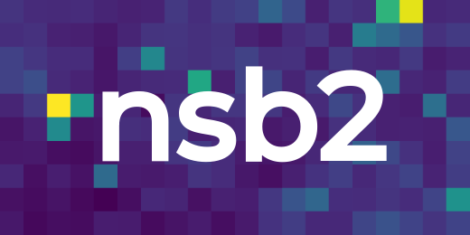

<!-- language: lang-none -->


# nsb2: Simulating Night Sky Background for IACTs

nsb2 is a python library for calculating the effect of night sky background (NSB) on telescopes with large pixel areas, namely imaging air cherenkov telescopes (IACTs). It includes models from theory / experimental data for star light, zodiacal light, moon light, diffuse galactic light and airglow. It also models atmospheric effects, such as rayleigh scattering, mie scattering, single scattering albedo and aerosol concentration. Telescope models can be created from raytracing data or using simple radial PSF models. Both forward and backward propagation of light through telescope/atmosphere/source layers is supported in the same simulation, with a computational graph being created at initialization.

nsb2 offers an interface with ctapipe, enabling simulation of simple telescope models from ctapipe geometries as well as making use of ctapipe plotting capability.

# Installation

## Installation from source
The newest version of this package can be built from source by cloning this repository and manually installing:

```bash
git clone https://github.com/GerritRo/nsb2.git
pip install ./nsb2
```

## Requirements
nsb2 requires the following packages:
- [astropy](https://github.com/astropy/astropy)
- [healpy](https://github.com/healpy/healpy)
- [numpy](https://github.com/numpy/numpy)
- [scikit-learn](https://github.com/scikit-learn/scikit-learn)
- [scipy](https://github.com/scipy/scipy)
- [histlite](https://github.com/GerritRo/histlite)

# Quick Start
An [example](examples/HESSI_Tutorial.ipynb) based on the HESS-I telescope is provided as a Jupyter Notebook together with other notebooks in this folder.

# Citing nsb2
If you use nsb2 in a scientific publication, we would appreciate if you cited this repository:

```
@misc{roellinghoff_2025_nsb2,
    author = {Roellinghoff, Gerrit},
    title = {nsb2: Simulating Night Sky Background for IACTs},
    url = {https://github.com/GerritRo/nsb2},
    year = {2025}
}
```
Please also cite the origin of all telescope/atmospheric/emission models you use in your work.

# Contributing
Contributions are welcome, especially new atmospheric / telescope models for IACTs. Contributing guidelines can be found [here](CONTRIBUTING.md).

# License
nsb2 is licensed under the MIT license. A copy can be found [here](LICENSE).